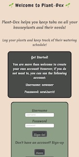

Plant-Dex!

Keep a your house plants in one spot! This app allows users to create a list of
their house plants and keep tabs on their watering schedules.

The user can set the frequencey of watering and when they login there are reminders to let them
know when to water the plant!

You can find the live app here: https://plant-dex.vercel.app/

You are more then welcome to create your own account. However, if you just want to take a peak
at the app you can use the demo account

-------------------------
Demo User Details:

username: newuser
 
password: newPassword2!

-------------------------

Screenshots:

 

 

Technology:

Front End

    -React
    -HTML
    -CSS(No frameworks)

Testing

    -Jest

Production

    -Deployed using Vercel

-------------------------

Getting Started

Run npm install to load dependencies

Run npm test to ensure a stable build

This is only the front end client, to develop locally you'll need the backend server as well.

To get the backend up and running see https://github.com/LeahArden175/plant-dex-server

Deployments are handled through vercel and can be run via npm run deploy